# Machine Learning Course - TDDE01

This repository contains lab-solutions for the **TDDE01 Machine Learning** course taken at Linköping University during the fall of 2023. The course includes three labs focusing on core ML concepts.

## Contents

1. [Lab Descriptions](#lab-descriptions)
2. [How to Run](#how-to-run)
3. [Resources](#resources)

## Lab Descriptions

### Lab 1: Introduction to ML
- **KNN**: Classify handwritten digits (`kknn` package).
 
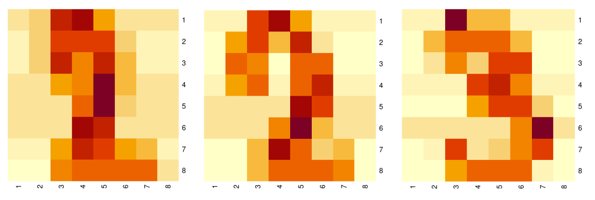
 

- **Linear Regression**: Predict Parkinson’s metrics.
- **Logistic Regression**: Binary classification with basis expansion.
 
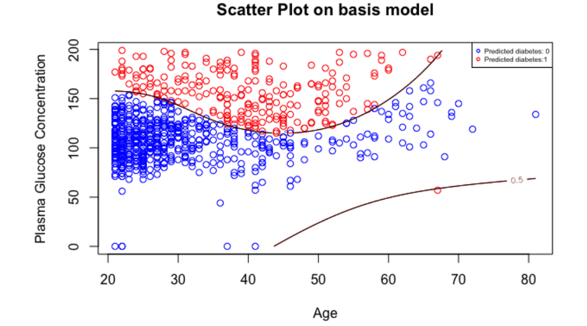
 

### Lab 2: Advanced Models
- **Regularization**: LASSO and Ridge regression on Tecator data.
 
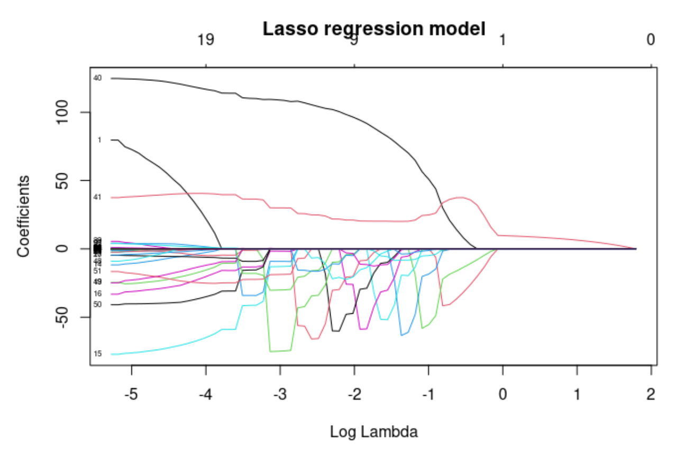
 
 
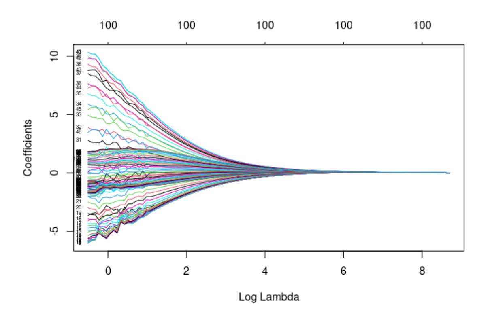
 
 
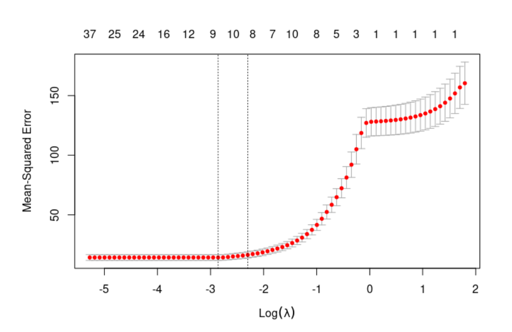
 

- **Decision Trees**: Tree-based prediction and analysis.
 
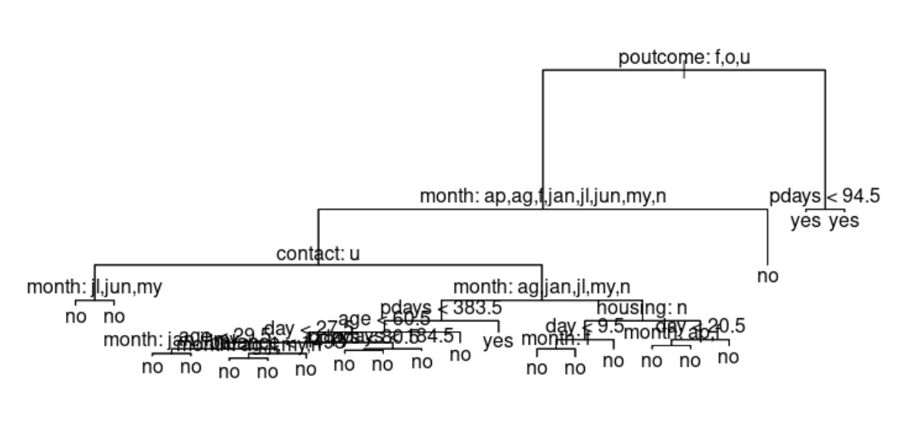
 
 
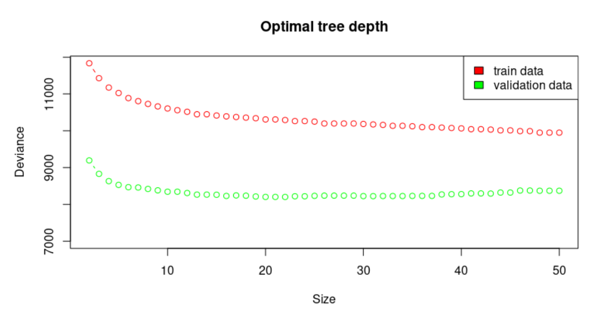
 
 
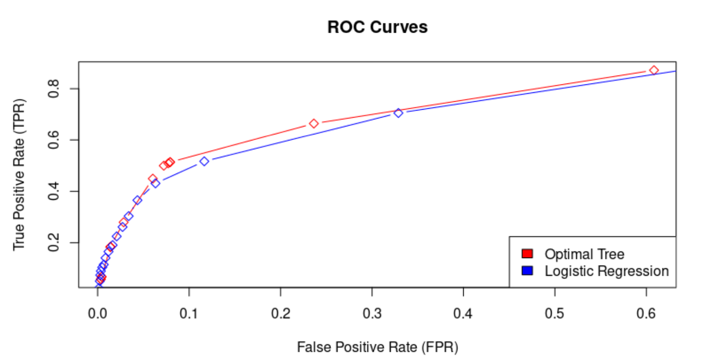
 

- **PCA**: Dimensionality reduction on crime data.
 
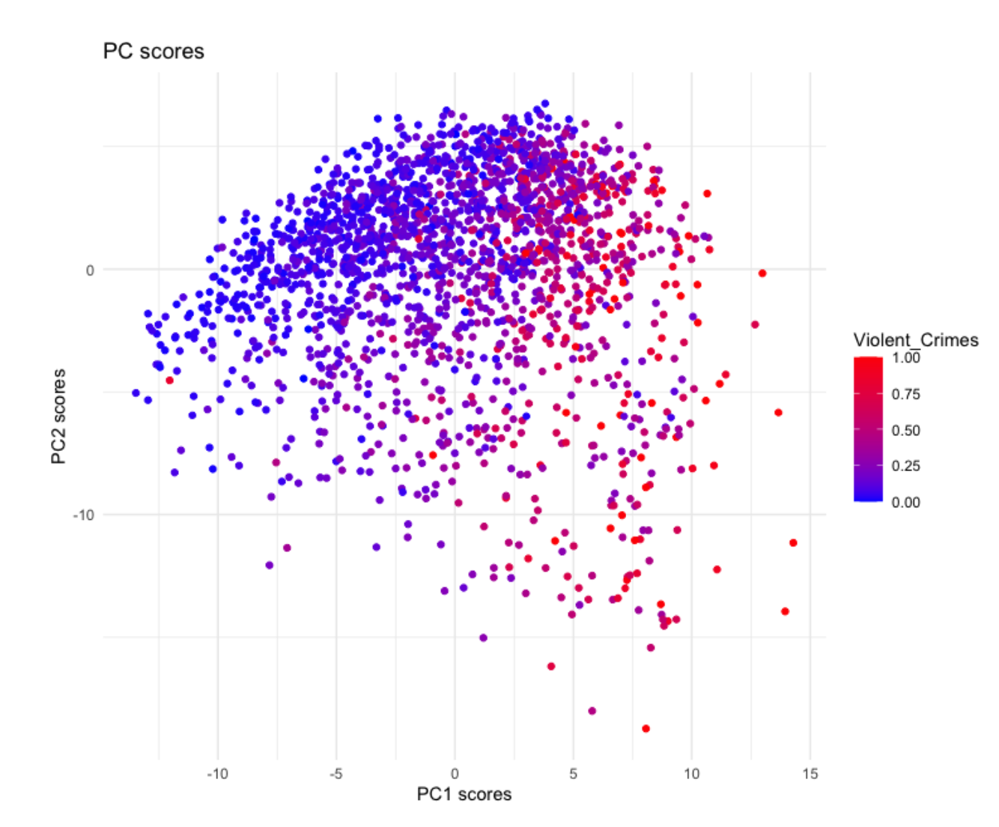
 
 
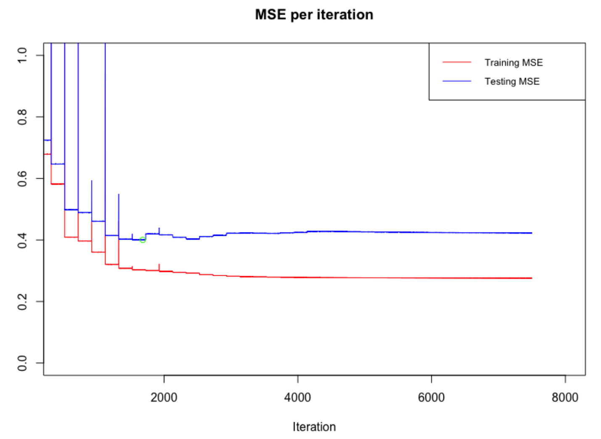
 

### Lab 3: Kernel Methods, SVMs, Neural Networks
- **Kernel Methods**: Predict temperatures using Gaussian kernels.
 
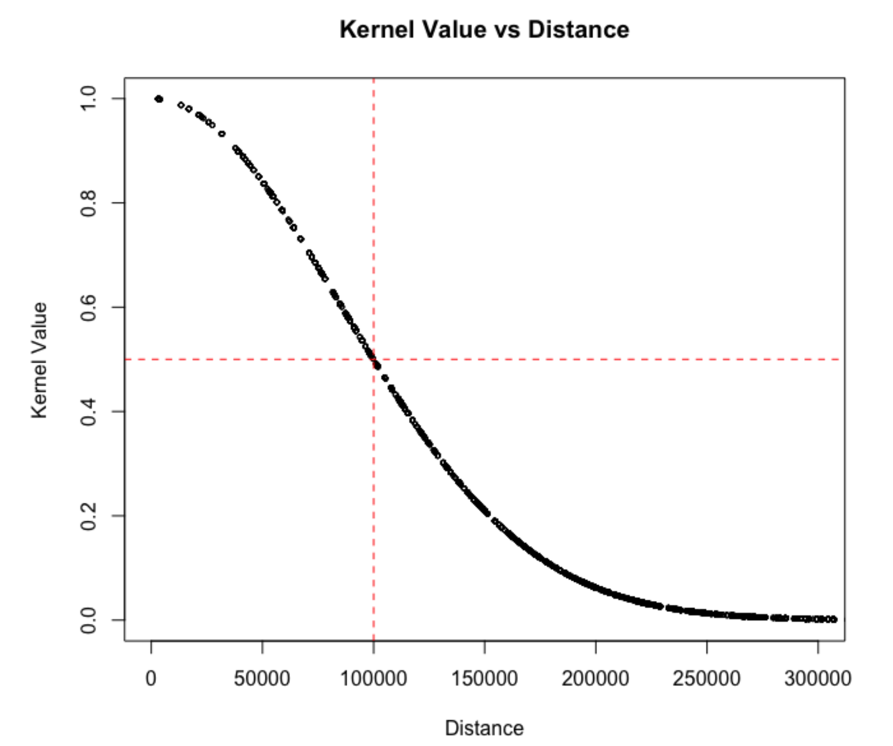
 
 
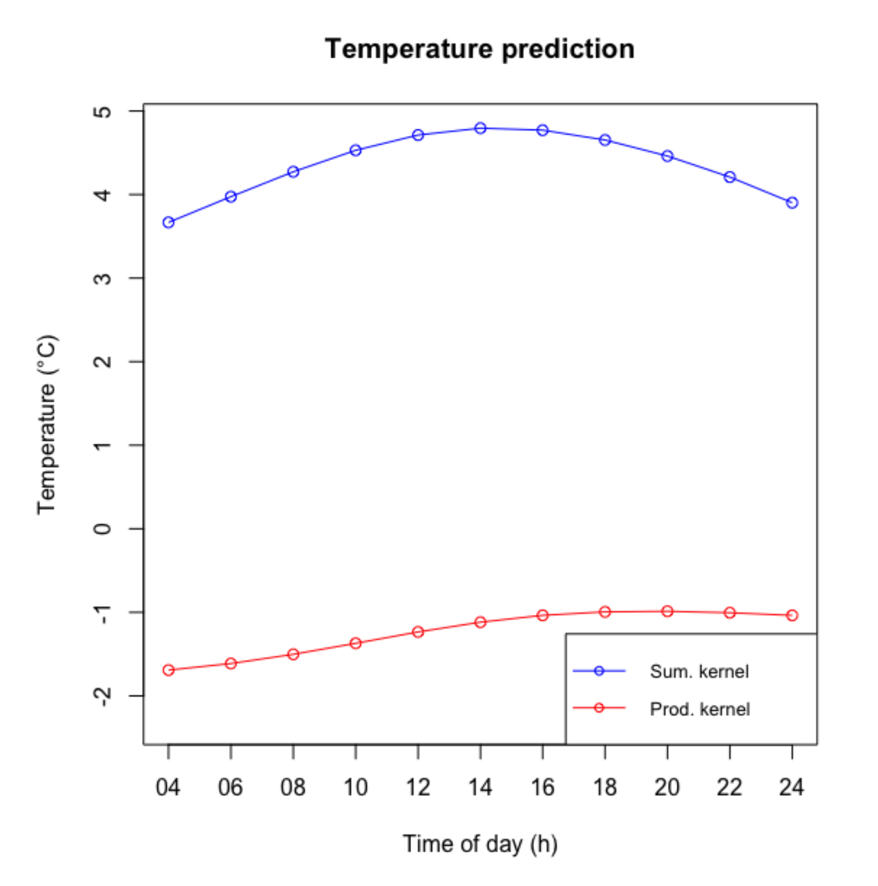
 

- **SVM**: Spam classification (`kernlab` package).

- **Neural Networks**: Learn sine function with various activations.
 
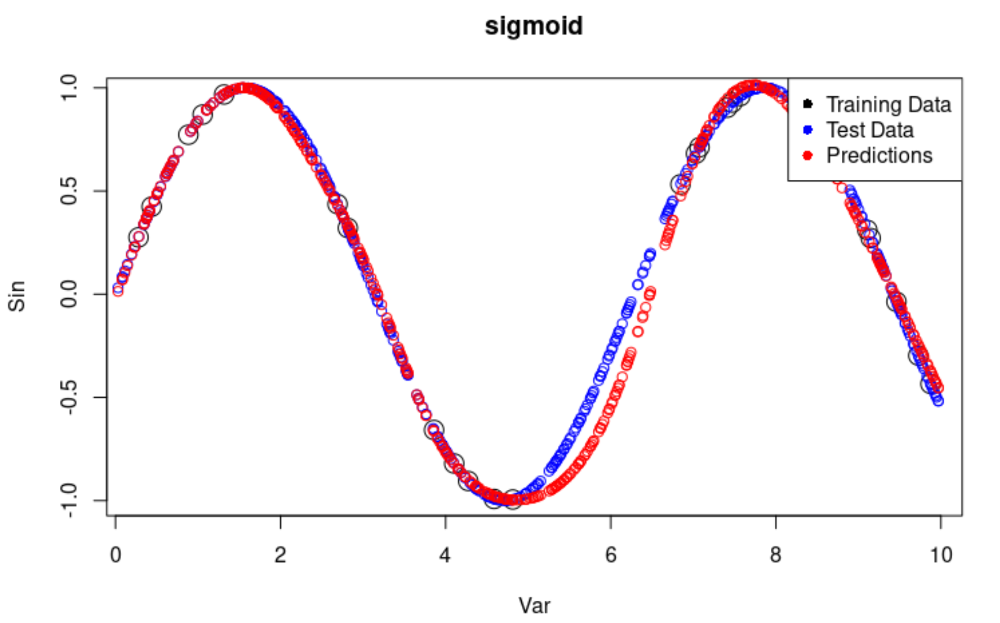
 
 
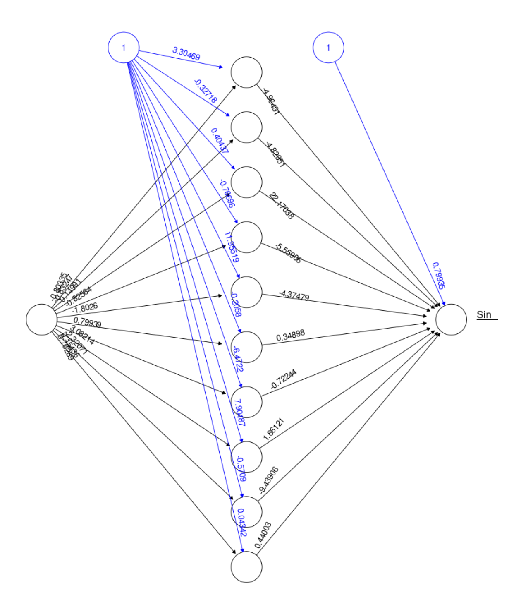
 

## How to Run
- **Set Up**: Install required R packages:
  `kknn`, `caret`, `glmnet`, `kernlab`, `geosphere`, `neuralnet`.
- **Execution**: Run `.r` scripts in respective lab folders.
- **Reproducibility**: Use `set.seed(12345)` for consistent results.

## Resources

- **Helpfile.pdf**: Located in `/Other/`, containing exam tips.
- **data-wrangling-cheatsheet.pdf**: Data-wrangling with dplyr and tidyr made easy.
